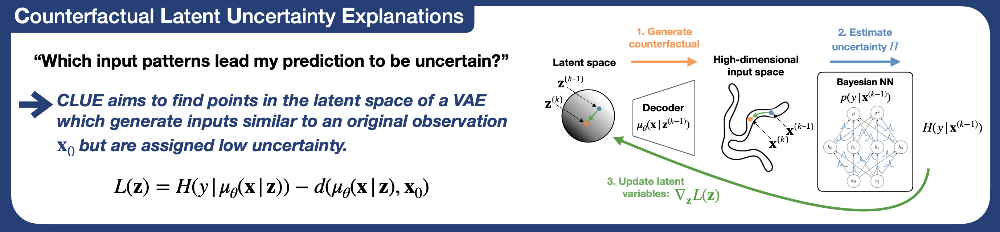

# Getting a CLUE: A  Method for Explaining Uncertainty Estimates, ICLR 2021


<p align="center">

</p>

Both uncertainty estimation and interpretability are important factors for trustworthy machine learning systems. However, there is little work at the intersection of these two areas. We address this gap by proposing a novel method for interpreting uncertainty estimates from differentiable probabilistic models, like Bayesian Neural Networks (BNNs). Our method, Counterfactual Latent Uncertainty Explanations (CLUE), indicates how to change an input, while keeping it on the data manifold, such that a BNN becomes more confident about the input’s prediction. We validate CLUE through 1) a novel framework for evaluating counterfactual explanations of uncertainty, 2) a series of ablation experiments, and 3) a user study. Our experiments show that CLUE outperforms baselines and enables practitioners to better understand which input patterns are responsible for predictive uncertainty.

You can find the paper at: [openreview.net/pdf?id=XSLF1XFq5h](https://openreview.net/pdf?id=XSLF1XFq5h) or [](https://arxiv.org/abs/2006.06848)

**Index:**\
[Dependencies](#dependencies)\
[Loading PreTrained Models](#loading-pretrained-models)\
[Training Models](#training-models)\
[Generating CLUEs](#generating-clues)\
[Artificial Data Experiments](#artificial-data-experiments)\
[Ablation Experiments](#ablation-experiments)\
[Citation](#citation)


## Dependencies
python 2.7.17 \
torch 1.3.1 \
torchvision  0.4.2\
urllib3  1.25.3\
scikit-image 0.14.2\
scikit-learn 0.20.3\
scipy  1.2.1\
numpy  1.16.5 \
matplotlib  2.2.5

Lime and Shap are only used for experiments from appendix F:\
lime  0.1.1.37\
shap  0.28.5

## Downloading notebooks and PreTrained models

**Due to their large size, our pre-trained models and notebooks which we use to run all experiments, are available at**: https://drive.google.com/file/d/1wZqEUn0TylpSEpKOTRD4kIVOAa3iNb0T/view?usp=sharing\
The zip file (4.6GB) will create a folder called notebooks. It contains the notebooks 
described in the rest of this README as well as the datasets we use and our pre-trained models.

We recommend replicating our experiments using the provided pre-trained 
models. These should be stored in the [notebooks/saves](notebooks/saves) folder.
They will be loaded automatically by the experiment notebooks. 


## Training Models

The [BNN](BNN) folder contains the source code for BNNs trained with scale adapted SG-HMC. (For different BNN inference methods, please refer to [JavierAntoran/Bayesian-Neural-Networks](https://github.com/JavierAntoran/Bayesian-Neural-Networks))
The [NN](NN) folder contains the source for training regular NNs, used in appendix H1.
The [VAE](VAE) and [VAEAC](VAEAC) folders contain the source for training VAEs and VAEACs respectively.

We use the notebooks contained in [notebooks/train_models](notebooks/train_models) to train all models.
Running the notebooks as provided will train and save models in the [notebooks/saves](notebooks/saves)
directory. Models will be saved with the correct names to be loaded directly
by experiment notebooks. 

We also include scripts to train VAEs of multiple depths for our experiments from section 5.3.
These are found in [train_scripts/train_VAEs](train_scripts/train_VAEs).

## Experiments

The [interpret](interpret) folder contains the code for CLUE, U-FIDO, our computational evaluation framework
and auxiliary functions.

### Generating Counterfactuals

MNIST CLUEs can be generated using [notebooks/experiments/CLUE_pythonclass_testing_MNIST.ipynb](notebooks/experiments/CLUE_pythonclass_testing_MNIST.ipynb)\
U-FIDO counterfactuals on MNIST can be generated using [notebooks/experiments/MNIST_FIDO.ipynb](notebooks/experiments/MNIST_FIDO.ipynb)\
COMPAS counterfactuals can be generated using [notebooks/experiments/CLUE_pythonclass_wiewing_Tabular_COMPAS.ipynb](notebooks/experiments/CLUE_pythonclass_wiewing_Tabular_COMPAS.ipynb)\
LSAT counterfactuals can be generated using [notebooks/experiments/CLUE_pythonclass_wiewing_Tabular_LSAT.ipynb](notebooks/experiments/CLUE_pythonclass_wiewing_Tabular_LSAT.ipynb)\

#### CLUEs on modified MNIST (479)

To generate CLUEs for our modified MNIST dataset, used in the additional
human subject experiments from appendix J use [notebooks/human_experiments/human_MNIST_479.ipynb](notebooks/human_experiments/human_MNIST_479.ipynb).


### Ablation Experiments

Tabular ablation experiments are contained in [notebooks/experiments/art_data/ablation](notebooks/experiments/ablation)\
MNIST ablation experiments are contained in [notebooks/experiments/art_data/MNIST_ablation](notebooks/experiments/MNIST_ablation)


### Artificial Data Experiments

[notebooks/experiments/art_data/Artificial_data_Tabular.ipynb](notebooks/experiments/art_data/Artificial_data_Tabular.ipynb)
Contains the code to reproduce our computational evaluation framework results for LSAT COMPAS, Credit and Wine.


[notebooks/experiments/art_data/Artificial_data_MNIST.ipynb](notebooks/experiments/art_data/Artificial_data_MNIST.ipynb)
Contains the code to reproduce our computational evaluation framework results for MNIST.

### Human Experiment Notebook

The notebook used to generate the questions for the user studies is found at [notebooks/human_experiments/Tabular_Data_Main_Survey.ipynb](notebooks/human_experiments/Tabular_Data_Main_Survey.ipynb)


## Citation

If this code was useful, please cite

> Javier Antorán, Umang Bhatt, Tameem Adel, Adrian Weller & José Miguel Hernández-Lobato (2021). Getting a CLUE: A  Method for Explaining Uncertainty Estimates. [[bibtex]](antoran2020getting.bib)

```bibtex
@inproceedings{
antoran2021getting,
title={Getting a {\{}CLUE{\}}: A  Method for Explaining Uncertainty Estimates},
author={Javier Antoran and Umang Bhatt and Tameem Adel and Adrian Weller and Jos{\'e} Miguel Hern{\'a}ndez-Lobato},
booktitle={International Conference on Learning Representations},
year={2021},
url={https://openreview.net/forum?id=XSLF1XFq5h}
}
``` 